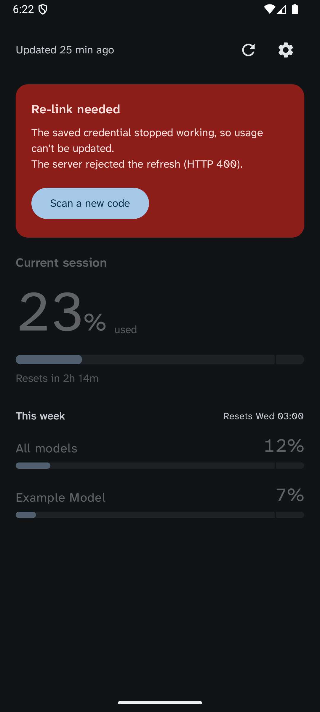

<div align="center">

# Headroom

**How much Claude subscription capacity you have left — on your phone, without your computer.**

[](https://github.com/USER/headroom/actions/workflows/ci.yml)
[](LICENSE)
[](#installing)

</div>

---

Headroom renders the same bars as Claude Code's `/usage` — current session,
current week, and each per-model weekly window — and notifies you on four
events: session reset, weekly reset, an approaching-limit line you choose, and
hitting the wall.

It reads usage directly from the API and holds its own credential, so it works
with your computer asleep or switched off. No companion process, no relay, no
same-network requirement.

<div align="center">


<em>Fine, approaching, and at the wall — told apart by fill against the notch,<br>
number weight, and track texture, not by colour alone.</em>

</div>

## What makes it different

**The three states read without colour.** Fill position against a notch cut at
*your* warning line, number weight, and a hatched track when a limit is used
up. Greyscale it, glance at it, or be colour-blind — it still reads. Colour is
never the only cue.

**The notch is your number.** It sits at the threshold you set in Settings, so
the bar and the notification can never disagree about where your line is.

**It never fails silently.** Offline keeps the last reading with its age rather
than showing zeros. A rejected credential says so and offers a re-link. A limit
type the server has never sent before is displayed as it came, not dropped.

<div align="center">

<br>
<em>The only alarming thing in the app. The last reading stays,<br>dimmed, because it is still true — just old.</em>
</div>

**It ships no Anthropic identifiers.** Not a client ID, not an endpoint, not a
hostname. See below.

## Installing

Grab the APK from [Releases](../../releases), or — better — point
[Obtainium](https://github.com/ImranR98/Obtainium) at this repository and let it
handle updates.

Android 12 or newer.

> Not on Google Play or F-Droid. F-Droid is currently impossible because the
> barcode scanner is Google's ML Kit, which is not open source; see
> [`docs/follow-ups.md`](docs/follow-ups.md).

## Linking

Headroom is **bring-your-own-credential**. It ships with nothing, and you link
it to your own account by running one command on your own computer:

```
/headroom-link
```

That reads the credentials Claude Code already stores on your machine and
renders them as a QR code in your terminal. Scan it. The bars appear.

Three ways, easiest first:

1. **Claude Code slash command** — `/headroom-link` from a clone of this repo.
   Zero install, works on macOS, Linux and Windows.
2. **Standalone** — `uv run --directory tools headroom-link`. Add `--text` to
   print the payload for manual paste.
3. **Manual paste** — run with `--text` and paste it into the app.

Treat the payload like a password: it grants access to your account. Nothing is
written to disk; the generator prints to your terminal only.

> The QR needs a terminal **at least 85 columns wide**. Narrower and it wraps,
> which looks like a QR and will not scan — the generator warns you rather than
> letting you find out by holding up a phone.

Credentials are read from whichever store your system uses:
`~/.claude/.credentials.json`, the macOS Keychain, `secret-tool`, or `kwallet`.
On macOS the Keychain is the usual source. The two Linux keystores are
unverified guesses — see [`docs/discovery-notes.md`](docs/discovery-notes.md).

On the phone, tokens are held in the Android Keystore and never logged.

## This is not an official Anthropic client

Headroom is an unofficial, community tool. It is not built, endorsed, or
supported by Anthropic, and it ships **no Anthropic credentials or identifiers
of any kind** — no client ID, no endpoint URLs, no hostnames. Architecturally it
is a generic OAuth usage meter that displays whatever credential you hand it;
everything provider-specific arrives in the QR code, from your own machine.

Two consequences you should know before using it:

- Reading usage this way is **off-label**. It relies on an endpoint that is not
  publicly documented and can change or stop working at any time.
- The app refreshes the token it is given, which **may sign out Claude Code on
  your computer** (and vice versa). If that happens, re-link — it is one
  command.

If you want an officially supported view of this data, use `/usage` in Claude
Code.

## How it is built

Two Gradle modules. `:domain` is a plain Kotlin JVM library holding the models,
the parser, the trigger rules and the payload codec — it has no Android
dependency at all, so "logic free of framework types" is enforced by the build
rather than by discipline. `:app` is Compose, Ktor, Koin, WorkManager, CameraX,
and an exact alarm for punctual reset notifications.

```bash
./gradlew :domain:test :app:testDebugUnitTest   # 177 tests
uv run --directory tools pytest                 # 59 tests
./scripts/check-distribution.sh                 # the constraints publishing depends on
```

The generator in `tools/` is a `uv`-managed Python package: an ordered chain of
platform-specific resolvers finds the credential, a provider resolver finds the
endpoints, and a codec renders both as `headroom1:` + base64url(zlib(json)).
A golden fixture is shared byte-for-byte with the app's test suite, so the two
halves cannot drift apart without a red test.

| | |
| --- | --- |
| [`docs/verification.md`](docs/verification.md) | The end-to-end run, and four bugs no unit test could reach |
| [`docs/discovery-notes.md`](docs/discovery-notes.md) | What was verified against a live install, and when |
| [`docs/ui-design-direction.md`](docs/ui-design-direction.md) | Why the screens and the app mark look the way they do |
| [`docs/follow-ups.md`](docs/follow-ups.md) | What is knowingly still open |
| [`docs/releasing.md`](docs/releasing.md) | Cutting a release |

## Licence

[Apache 2.0](LICENSE). Third-party notices in [NOTICE](NOTICE); the bundled
typeface is [Atkinson Hyperlegible
Next](https://github.com/googlefonts/atkinson-hyperlegible-next) under the SIL
Open Font License, chosen because this is a screen of digits read at a glance.
