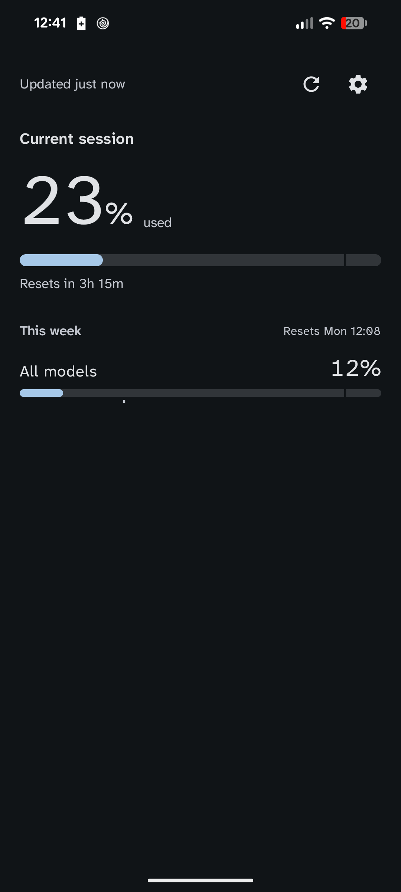
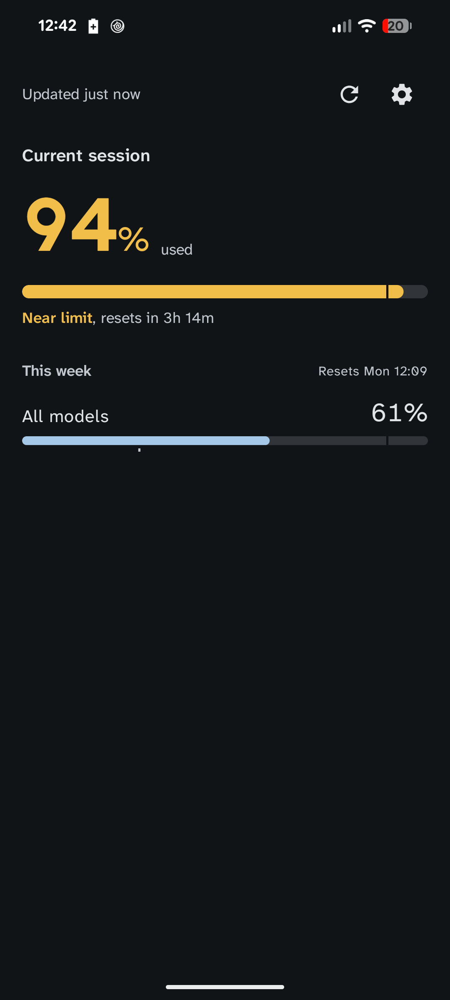
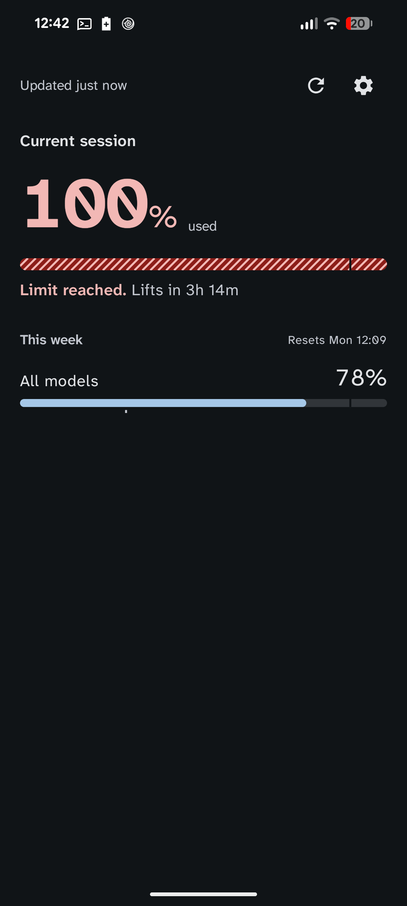

<div align="center">

# Headroom

**How much Claude subscription capacity you have left — on your phone.**

[](https://github.com/andriykohut/headroom/actions/workflows/ci.yml)
[](LICENSE)
[](#installing)

</div>

---

Headroom renders the same bars as Claude Code's `/usage` — current session,
current week, and each per-model weekly window — and notifies you on four
events: session reset, weekly reset, an approaching-limit line you choose, and
hitting the wall.

Your machine reports its usage while you work. A small relay you host keeps the
last reading. Your phone reads it from there.

<div align="center">





<em>Fine, approaching, and at the wall — told apart by fill against the notch,<br>
number weight, and track texture, not by colour alone.</em>

</div>

## What makes it different

**The three states read without colour.** Fill position against a notch cut at
*your* warning line, number weight, and a hatched track when a limit is used
up. Greyscale it, glance at it, or be colour-blind — it still reads. Colour is
never the only cue.

**The notch is your number.** It sits at the threshold you set in Settings, so
the bar and the notification can never disagree about where your line is.

**It never fails silently.** Offline keeps the last reading with its age rather
than showing zeros. A limit type the server has never sent before is displayed
as it came, not dropped.

**Your phone holds no account credential.** It holds a relay address and a
shared secret. Someone who steals your phone learns your quota usage; they do
not get your Claude account.

**It ships no Anthropic identifiers.** Not a client ID, not an endpoint, not a
hostname. See [below](#this-is-not-an-official-anthropic-client).

## How it works

```
  your machine                    your relay                     your phone
 ┌──────────────┐    push        ┌────────────┐     poll        ┌──────────┐
 │ Claude Code  │ ─────────────▶ │  headroom  │ ◀────────────── │ Headroom │
 │ status line  │  while you     │   serve    │                 │   app    │
 └──────────────┘  are working   └────────────┘                 └──────────┘
```

Claude Code runs a **status line** command on every message, and hands it a JSON
payload that already contains your five-hour and seven-day usage. Reporting
those costs nothing at all — the numbers arrived on a response you had already
paid for. That is the bulk of what you see, and it updates as you type.

Every five minutes, and only while you are actually working, `headroom push`
also fetches the full picture, which adds the **per-model weekly windows** that
the status line does not carry. That is one request per five minutes of active
coding, and none at all overnight.

The relay is a store-and-forward box and nothing else. It holds no credential,
never contacts Anthropic, and knows three percentages and three reset times. The
phone cannot be reached directly — it has no stable address on a mobile network
— which is the whole reason the relay exists.

**Nothing here refreshes a token, so nothing here can invalidate your login.**
That was the flaw in the previous design, where the phone held a copy of Claude
Code's credential and the two clients fought over a rotating refresh chain. See
[`docs/architecture-options.md`](docs/architecture-options.md).

## Installing

**The app.** Grab the APK from [Releases](../../releases), or — better — point
[Obtainium](https://github.com/ImranR98/Obtainium) at this repository and let it
handle updates. Android 12 or newer.

**The CLI.** One binary, `headroom`, with three subcommands. You need it in two
places: on the machine you code on (`push`, `link`) and on whatever always-on
box runs the relay (`serve`). They can be the same machine if that machine is
always on.

```bash
curl -fsSL https://raw.githubusercontent.com/andriykohut/headroom/main/scripts/install.sh | sh
```

It installs to `~/.local/bin`, needs no `sudo`, and verifies a SHA-256 checksum
before it installs anything. Set `HEADROOM_INSTALL_DIR` to put it elsewhere.

If you would rather not pipe a script to a shell — reasonable — do it by hand.
Pick your target from the [release assets](../../releases/latest):

```bash
target=aarch64-apple-darwin   # or x86_64-apple-darwin,
                              # x86_64-unknown-linux-musl, aarch64-unknown-linux-musl
base=https://github.com/andriykohut/headroom/releases/latest/download
curl -fsSLO "$base/headroom-$target"
curl -fsSLO "$base/SHA256SUMS"
shasum -a 256 --ignore-missing --check SHA256SUMS   # sha256sum on Linux
chmod +x "headroom-$target" && mv "headroom-$target" ~/.local/bin/headroom
```

With a Rust toolchain (1.89 or newer) you can build it instead. The crate is
`headroom-cli`; the command it installs is `headroom`:

```bash
cargo install headroom-cli
```

For the relay box specifically, there is an image — one static binary on
`scratch`, no shell, no package manager:

```bash
chown 65534:65534 /etc/headroom   # see why, just below
docker run -v /etc/headroom:/keys -v headroom-data:/data \
  -p 127.0.0.1:8765:8765 \
  ghcr.io/andriykohut/headroom \
  serve --push-secret-file /keys/push-key --read-secret-file /keys/read-key
```

The image binds `0.0.0.0` rather than the binary's loopback default, because
loopback inside a container is unreachable even from your reverse proxy. Publish
the port to `127.0.0.1` as above and keep TLS in front of it, exactly as with
the binary.

State lands at `/data/.local/state/headroom/relay.json` — the image sets
`HOME=/data`. Use a **named** volume (`headroom-data`, above), not a bare
`docker run` with no `-v`: an unnamed mount becomes an anonymous volume, and
`docker rm` followed by a fresh `docker run` on upgrade orphans it, losing
every reading. A named volume survives that. If you bind-mount a host
directory instead of a named volume, Docker will not `chown` it for you — it
must already be writable by uid 65534, or the relay's writes silently do
nothing; the state write is best-effort and reports no error.

The `chown` above matters for the same reason: the container runs as uid
65534, and the keys directory is a bind mount, which the image's own
`--chown` (that gives `/data` to uid 65534) does not reach. If you `chmod 600`
those key files as [the relay setup below](#1-the-relay) recommends, a
root-owned, mode-0600 key is unreadable to uid 65534 — and the binary then
reports no shared secret was configured, even though you passed both key
flags, because it cannot tell "you gave me nothing" from "I was refused
permission to read what you gave me."

> Downloading through a browser rather than `curl` puts macOS's quarantine flag
> on the file, and Gatekeeper will refuse to run it. `xattr -d
> com.apple.quarantine ./headroom` clears it. The binaries are ad-hoc signed,
> which is what Apple Silicon requires to execute them, but they are not
> notarized.

Building from a clone still works, and is what contributors want:
`cargo install --path cli`.

> Not on Google Play or F-Droid yet. Every dependency is open source, so
> F-Droid is possible — it just has not been submitted.

## Setting it up

### 1. The relay

On your server. Generate **two** keys:

```bash
mkdir -p ~/.config/headroom
headroom serve --new-secret > ~/.config/headroom/push-key
headroom serve --new-secret > ~/.config/headroom/read-key
chmod 600 ~/.config/headroom/*-key

headroom serve \
  --push-secret-file ~/.config/headroom/push-key \
  --read-secret-file ~/.config/headroom/read-key
```

Two, because the two clients need opposite things. Your machine writes and
never reads; your phone reads and never writes. Give each only what it needs
and a photographed QR code leaks what fraction of your quota is gone without
letting anyone forge it — and either key can be rotated without touching the
other. Presenting the read key to a `POST` fails exactly as a stranger's key
would; neither is a master key.

A single `--secret-file` uses one key for both. That works, and the relay says
so on startup, but it means your phone is carrying something that can also
overwrite readings.

A systemd unit, if you want one:

```ini
[Service]
ExecStart=/usr/local/bin/headroom serve \
  --push-secret-file /etc/headroom/push-key \
  --read-secret-file /etc/headroom/read-key
DynamicUser=yes
StateDirectory=headroom
# always, not on-failure: a relay that stops answering looks identical from the
# phone to one with nothing new to say, so nothing will tell you it is down.
Restart=always
RestartSec=5
# It stores percentages and talks to nothing. Give it nothing.
ProtectSystem=strict
PrivateDevices=yes
NoNewPrivileges=yes

[Install]
WantedBy=multi-user.target
```

**Put TLS in front of it.** It speaks plain HTTP and binds to loopback by
default, and the phone sends its key on every request. The app refuses
cleartext outright, so this is enforced rather than advised:

```
your-relay.example.com {
	reverse_proxy 127.0.0.1:8765
}
```

The relay defends itself against slow and idle clients rather than relying on
that proxy to do it: connections that do not send request headers within
`--header-timeout` (10s) are closed, bodies must arrive within 15s, no
connection lives past 120s, and `--max-connections` (64) are served at once
while the rest wait in the kernel's queue. Flooded with idle connections it
holds at three threads and about 4 MB.

Check it: `curl https://your-relay/healthz` → `{"ok":false,"age_seconds":null}`
until the first reading arrives. That endpoint is deliberately unauthenticated
and deliberately says nothing but whether a reading exists and how old it is.

### 2. The status line

On the machine you code on. `headroom push` is a tee: it writes its input
straight back out, so it drops into whatever status line you already have.

```bash
# ~/.claude/statusline.sh
input=$(cat)
printf '%s' "$input" | headroom push >/dev/null

# ... your existing status line, using "$input" ...
```

Set the address and secret where the status line can see them — in
`~/.claude/settings.json`, in your shell profile, or as flags:

```bash
export HEADROOM_RELAY_URL=https://your-relay
export HEADROOM_RELAY_SECRET=...    # the push key; or --secret-file
```

Check it with `headroom push --once`, which does the work in the foreground and
says what happened instead of detaching. Never leave `--once` in a real status
line.

**It cannot slow your prompt down.** `push` writes your payload back out, hands
the network to a detached child, and exits — 2.6 ms median, 3.4 ms worst case,
and the same against a relay that accepts the connection and never answers.
That is a promise the status line runs into on every single message, so
[`cli/tests/push_does_not_block.rs`](cli/tests/push_does_not_block.rs) holds it
to a stopwatch rather than to a comment.

### 3. The phone

```
/headroom-link
```

or `headroom link --relay https://your-relay --read-secret-file <path>`. That
prints a QR code carrying the relay's address and its **read** key. Scan it in
the app.

> The QR needs a terminal **at least 85 columns wide**. Narrower and it wraps,
> which looks like a QR and will not scan — the command warns you rather than
> letting you find out by holding up a phone.

Treat the payload like a password — but a narrow one. It is not account access,
and with two keys it is not write access either: someone who photographs it
learns how much of your quota you have used, and nothing else.

## This is not an official Anthropic client

Headroom is an unofficial, community tool. It is not built, endorsed, or
supported by Anthropic, and it ships **no Anthropic credentials or identifiers
of any kind** — no client ID, no endpoint URLs, no hostnames. The app is
architecturally a generic usage meter pointed at a URL you give it.

Two things you should know before using it, stated plainly:

- **The status line half costs no requests.** Claude Code computes your usage
  and hands it to your own status line command; Headroom reads what is already
  there. Nothing is polled, nothing extra is asked for, and this is a
  documented Claude Code feature working as intended.

- **The enrichment half calls an undocumented endpoint.** Anthropic's Consumer
  Terms (§3) prohibit accessing the Services *"through automated or non-human
  means"* except via an API key or where explicitly permitted, and a scripted
  fetch is automated access on a plain reading. What makes this a narrower
  question than it was: it runs on the machine where Claude Code is installed
  and logged in, only while you are actively using Claude Code, at most once
  every five minutes — a small fraction of the requests your own session is
  already making. Nothing runs when you are not working. The risk is to your
  account, and the choice is yours; `--interval 0` is not a thing you can set,
  and the floor is 60 seconds for the same reason.

  If you would rather not make that call at all, leave it: without enrichment
  you still get the session and weekly bars, and lose only the per-model ones.

Nothing leaves your phone except requests to your own relay. No analytics, no
crash reporting, no third-party service. See [`PRIVACY.md`](PRIVACY.md).

If you want an officially supported view of this data, use `/usage` in Claude
Code.

## How it is built

Two Gradle modules and one Rust crate.

`:domain` is a plain Kotlin JVM library holding the models, the parser, the
trigger rules and the payload codec — no Android dependency at all, so "logic
free of framework types" is enforced by the build rather than by discipline.
`:app` is Compose, Koin, WorkManager, CameraX, and an exact alarm for punctual
reset notifications.

`cli/` is the desktop and server side: `push`, `serve` and `link` in one static
binary with no async runtime, because the status line hook has to start, do one
thing and exit on every message you send.

```bash
./gradlew :domain:test :app:testDebugUnitTest   # 163 tests
cargo test --manifest-path cli/Cargo.toml       # 65 tests
./scripts/check-distribution.sh                 # the constraints publishing depends on
```

A golden fixture in `fixtures/` is shared byte-for-byte between the CLI's tests
and the app's, so the two halves cannot drift apart without a red test.

| | |
| --- | --- |
| [`docs/architecture-options.md`](docs/architecture-options.md) | Why the phone stopped holding a credential |
| [`docs/verification.md`](docs/verification.md) | The end-to-end run, and the bugs no unit test could reach |
| [`docs/discovery-notes.md`](docs/discovery-notes.md) | What was verified against a live install, and when |
| [`docs/ui-design-direction.md`](docs/ui-design-direction.md) | Why the screens and the app mark look the way they do |
| [`docs/follow-ups.md`](docs/follow-ups.md) | What is knowingly still open |
| [`docs/releasing.md`](docs/releasing.md) | Cutting a release |

## Licence

[Apache 2.0](LICENSE). Third-party notices in [NOTICE](NOTICE); the bundled
typeface is [Atkinson Hyperlegible
Next](https://github.com/googlefonts/atkinson-hyperlegible-next) under the SIL
Open Font License, chosen because this is a screen of digits read at a glance.
